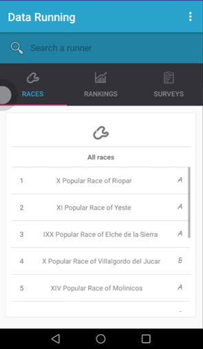

# Advanced-User-Interface-Design

* Asignatura: DISEÑO AVANZADO DE INTERFACES DE USUARIO
* Curso: CUARTO
* E.S. DE INGENIERIA INFORMATICA ALBACETE
* :es:

---

# Data-Running, la aplicación del atleta inteligente.

Proyecto Android para la asignatura Diseño Avanzado de Interfaces de Usuario.

Autores:

* Francisco Martínez Esteso

---

## Problema y motivación

Data Running surge como proyecto para la asignatura Diseño Avanzado de Interfaces de Usuario a fin de crear un proyecto Android para demostrar las competencias adquiridas en la asignatura acerca del diseño front-end de una app focalizado en el usuario. 

## Solución

Creamos un proyecto Android a partir de nuestros digagramas UML obtenidos previamente en una fase de modelado con los programas TERESA y Papyrus para Eclipse. Generamos el código a través de la librería UML2Android.
Importante añadir que no trabajamos con datos reales, virtualizamos la obtención de estos a través de un servidor en IBM Cloud.

## Funciones

* Permite la visualización de datos relativos al atleta de forma agradable al usuario, teniendo disponibles gran variedad de gráficas y estadísticas generadas a partir del procesamiento de los dato.
* Permite mantenerse informado de todo lo acontecido en el Circuito de Carreras Populares de Albacete.
* Permite el acceso a gran cantidad de información ligada a otros atletas.

## Posibles mejoras

* Refinamiento de la lógica de nuestra aplicación.
* Generación de una BBDD real para procesamiento.
* Creación y migración a un servicio web adaptable y ergonómico a cualquier dispositivo para su visualización.
